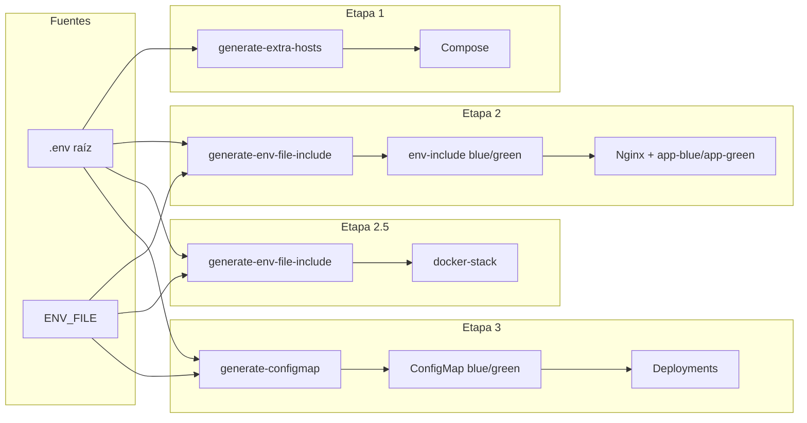
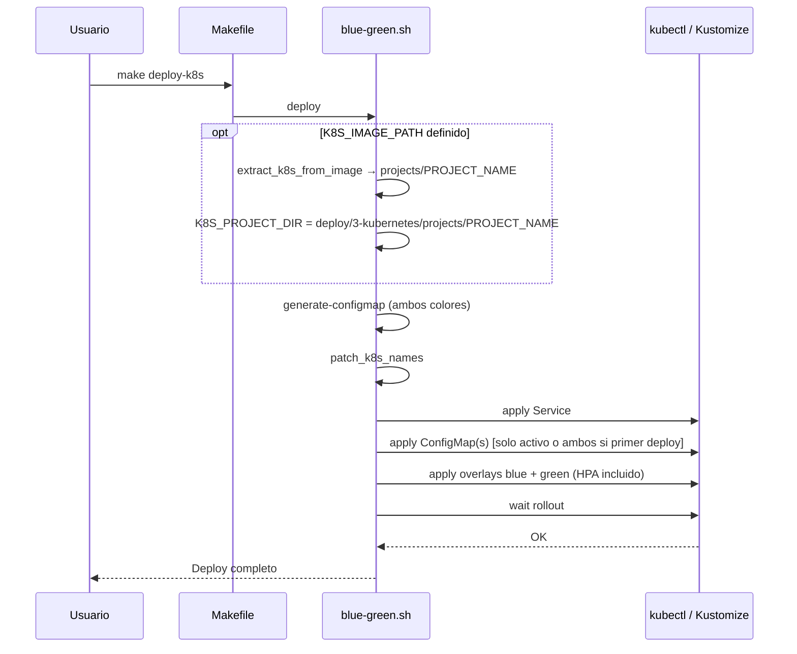
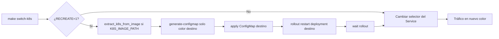
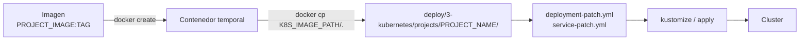

# Arquitectura y flujo de datos — Blue-Green (kit de despliegue)

Diagramas y flujos del framework de despliegue evolutivo. La carpeta `app/` es demo y no forma parte de la arquitectura del kit.

---

## 1. Vista general: etapas del framework

```
                    ┌─────────────────────────────────────────────────────────────────┐
                    │                        .env (raíz)                                │
                    │  PROJECT_NAME, PROJECT_IMAGE, PROJECT_VERSION, HEALTH_PATH, …   │
                    └────────────────────────────┬────────────────────────────────────┘
                                                 │
         ┌───────────────────────────────────────┼───────────────────────────────────────┐
         │                                       │                                         │
         ▼                   ▼                   ▼                   ▼                     ▼
   ┌──────────┐        ┌──────────┐        ┌──────────┐        ┌──────────┐        ┌──────────┐
   │ Etapa 0  │        │ Etapa 1  │        │ Etapa 2  │        │ Etapa 2.5│        │ Etapa 3  │
   │ manual   │        │ simple   │        │ blue-    │        │ swarm    │        │ k8s      │
   │          │        │ compose  │        │ green    │        │          │        │          │
   │ run.sh   │        │ 1 stack  │        │ Compose  │        │ 1 svc    │        │ Kind +   │
   │ sin      │        │          │        │ + Nginx  │        │ rolling  │        │ Kustomize│
   │ Docker   │        │          │        │ 2 stacks │        │ update   │        │ 2 stacks │
   └──────────┘        └──────────┘        └──────────┘        └──────────┘        └──────────┘
        deploy/            deploy/            deploy/            deploy/              deploy/
       0-manual/        1-simple-           2-blue-green-       2.5-swarm/           3-kubernetes/
                        compose/            compose/
```

**Flujo de datos:** Todas las etapas leen el mismo `.env`. Cada etapa añade variables propias sin renombrar las anteriores. El Makefile es el punto de entrada único (`make deploy-*`, `make switch-*`, etc.).

---

## 2. Flujo del .env hacia las etapas



- **Etapa 1:** `.env` → sustitución en compose y opcionalmente scripts (extra-hosts).
- **Etapa 2:** `.env` + `ENV_FILE` → `generate-env-file-include` → archivos inyectados en app-blue y app-green; Nginx conmuta tráfico.
- **Etapa 2.5:** `.env` + `ENV_FILE` → `generate-env-file-include` → stack YAML → servicio Swarm.
- **Etapa 3:** `.env` + `ENV_FILE` → `generate-configmap` → ConfigMaps por color → deployments blue/green.

---

## 3. Blue-green: flujo de tráfico (Compose y K8s)

Comportamiento alineado entre etapa 2 (Compose + Nginx) y etapa 3 (Kubernetes).

```mermaid
stateDiagram-v2
    [*] --> Blue_activo
    Blue_activo --> Green_activo: switch (o deploy a green)
    Green_activo --> Blue_activo: switch (rollback)
    Blue_activo --> Green_activo: switch RECREATE=1
    Green_activo --> Blue_activo: switch RECREATE=1

    note right of Blue_activo: Tráfico en blue\nInactivo: green
    note right of Green_activo: Tráfico en green\nInactivo: blue
```

| Acción | Efecto |
|--------|--------|
| **deploy** | Levanta/actualiza ambos stacks; en Compose puede levantar inactivo y hacer switch; en K8s aplica ambos, ConfigMap solo del activo (o ambos en primer deploy). |
| **switch** | Solo cambia el tráfico (Nginx o selector del Service). El stack inactivo no se toca → rollback posible. |
| **switch RECREATE=1** | Actualiza env/imagen del stack **destino**, lo reinicia, luego hace switch. El otro color conserva su config. |

---

## 4. Kubernetes (etapa 3): componentes

```mermaid
flowchart TB
    subgraph Cluster["Cluster K8s (Kind u otro)"]
        S[Service\nselector: version=blue|green]
        subgraph Blue
            CM_B[ConfigMap\n*-config-blue]
            D_B[Deployment\n*-deployment-blue]
            HPA_B[HPA]
            P_B[Pods blue]
        end
        subgraph Green
            CM_G[ConfigMap\n*-config-green]
            D_G[Deployment\n*-deployment-green]
            HPA_G[HPA]
            P_G[Pods green]
        end
    end
    User[Usuario / make]
    User -->|deploy-k8s| Gen[generate-configmap\npatch_k8s_names]
    User -->|switch-k8s| S
    User -->|switch RECREATE=1| Gen
    Gen --> CM_B
    Gen --> CM_G
    S -->|tráfico| P_B
    S -->|tráfico| P_G
    D_B --> P_B
    D_G --> P_G
    CM_B --> D_B
    CM_G --> D_G
    HPA_B --> D_B
    HPA_G --> D_G
```

- **Service:** Selector `version=blue` o `version=green`; conmuta el tráfico sin tocar pods.
- **ConfigMaps:** Uno por color (`*-config-blue`, `*-config-green`). En deploy solo se aplica el del activo (o ambos en primer deploy) para no pisar el inactivo.
- **Deployments:** Uno por color; cada uno usa su ConfigMap. HPA escala entre `minReplicas` y `maxReplicas` por CPU.

---

## 5. Flujo deploy K8s (simplificado)



---

## 6. Flujo switch K8s (con y sin RECREATE)



- **Sin RECREATE:** Solo se actualiza el selector del Service; los pods y ConfigMaps no se tocan → rollback = otro switch.
- **Con RECREATE:** Se actualiza solo el ConfigMap del color al que se cambia, se reinicia ese deployment y luego se hace el switch. El otro color conserva su ConfigMap.

---

## 7. Extracción k8s desde imagen (K8s)

Cuando se usa imagen de artifact y no se clona el repo:



- **Cuándo:** En `deploy-k8s` y en `switch-k8s RECREATE=1`; **no** en `switch-k8s` sin RECREATE.
- **Resultado:** Los patches del proyecto se usan desde `deploy/3-kubernetes/projects/PROJECT_NAME` (K8S_PROJECT_DIR se sobrescribe tras extraer).

---

## Resumen de artefactos por etapa

| Etapa | Entrada principal | Generados / aplicados | Salida |
|-------|-------------------|------------------------|--------|
| 0 | .env, ENV_FILE | — | Proceso local (run.sh) |
| 1 | .env | extra-hosts (opcional) | Compose, 1 stack |
| 2 | .env, ENV_FILE | env-include blue/green, projects/PROJECT_NAME (snippet) | Compose + Nginx, 2 stacks |
| 2.5 | .env, ENV_FILE | docker-stack env-include, backup/ | Stack Swarm, 1 servicio |
| 3 | .env, ENV_FILE | ConfigMaps blue/green, overlays, projects/PROJECT_NAME (si K8S_IMAGE_PATH) | Service + 2 Deployments + HPA |
